# 공기검토플랫폼 사용자 가이드

작성일: 2026-03-23  
대상: 공기검토플랫폼 일반 사용자

이 문서는 실제 업무에서 바로 사용할 수 있도록, 화면에서 보이는 메뉴와 버튼 이름 기준으로 작성된 안내서입니다.  
개발 용어 없이, 사용 순서와 주의사항 중심으로 설명합니다.

---

## 1) 전체 공기산정 빠른 시작

1. 홈에서 새 프로젝트를 만들고 유형을 `전체 공기산정`으로 선택합니다.
2. `가동률`에서 지역, 데이터 기간, 주간 작업일을 먼저 맞춘 뒤 저장합니다.
3. `표준품셈` 또는 생산성 관리 화면에서 기준 데이터를 점검합니다.
4. `공기산정기준`에서 공정표를 작성하고 저장합니다.
5. 필요하면 `기간 조정`으로 목표 공기에 맞춘 뒤 적용합니다.
6. `요약장표`에서 총 공기와 공종별 비중을 확인합니다.
7. `엑셀 내보내기`와 `보고서 내보내기`로 결과를 공유합니다.

---

## 2) 홈 화면

### 이 화면에서 하는 일

- 프로젝트 생성
- 프로젝트 검색
- 유형별 보기
- 정렬
- 자주 쓰는 프로젝트 고정
- 프로젝트 정보 수정 및 삭제

### 따라하기

```demo
create_project
```

1. `새 프로젝트`를 눌러 프로젝트를 생성합니다.
2. 프로젝트명을 입력하고 유형을 `전체 공기산정`으로 선택합니다.
3. 목록에서 생성된 프로젝트를 클릭해 진입합니다.
4. 자주 쓰는 프로젝트는 핀 버튼으로 고정합니다.
5. 필요하면 행 오른쪽 더보기 버튼에서 `이름/설명 수정`, `삭제`를 실행합니다.

### 자주 막히는 점

- 프로젝트가 안 보이면 검색어를 지우고 유형 필터를 `전체`로 바꿔 확인하세요.
- 최신 작업이 위로 오지 않으면 정렬을 `최근수정순`으로 바꾸세요.

---

## 3) 상단 헤더

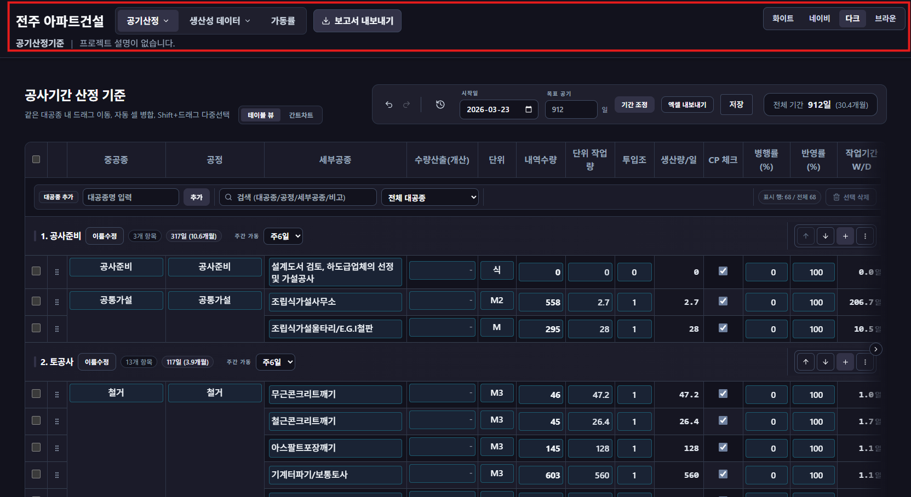

### 이 화면에서 하는 일

- 기능 화면 이동
- 보고서 내보내기
- 화면 테마 변경

### 따라하기

1. 상단 메뉴는 아래 구조로 이동합니다.
   - `가동률`
   - `생산성 데이터`
     - `표준품셈`
     - `CIP 생산성 관리`
     - `기성말뚝 생산성 관리`
     - `현장타설말뚝 생산성 관리`
   - `공기산정`
     - `공기산정기준`
     - `요약장표`
2. 전체 공기산정 프로젝트에서는 `보고서 내보내기` 버튼을 사용할 수 있습니다.
3. 오른쪽의 `화이트`, `네이비`, `다크`, `브라운` 버튼으로 화면 색상을 바꿀 수 있습니다.

### 자주 막히는 점

- 보고서가 다운로드되지 않으면 브라우저 다운로드 차단 여부를 먼저 확인하세요.

---

## 4) 가동률

### 이 화면에서 하는 일

- 날씨/근무 조건 기준으로 가동률 계산
- 대공종과 공정 단위의 조건 분리 관리

### 따라하기

```demo
operating_rate
```

1. `지역`, `데이터 기간`을 선택합니다.

2. 보기 모드를 선택합니다.

   - `통합`: 대공종 기준으로 간단히 관리
   - `혼합`: 대공종 기준으로 보되, 필요한 공정만 펼쳐 조정
   - `분리`: 공정별로 모두 개별 조정
3. 공정을 일괄로 맞추려면 `전체 합치기(상속)`을 누릅니다.

4. 공정을 개별 조정하려면 `전체 분리`를 누르거나, 각 공정의 `상속/분리`를 전환합니다.
|  |  |
|---|---|
| 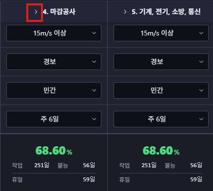 | 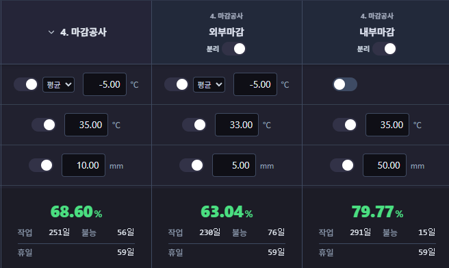 |

5. 동절기, 혹서기, 강우량, 강설량, 풍속, 미세먼지, 공공/민간, 주간 작업일을 조정합니다.
6. 저장 한 뒤 하단 산출 결과를 확인합니다.

### 자주 막히는 점

- 저장했는데 공정표 기간이 그대로면 공기산정기준 화면에서 다시 계산/저장해 반영을 확인하세요.
- 공정별 값이 예상과 다르면 `상속/분리` 상태를 먼저 확인하세요.

---

## 5) 생산성 관리

### 5.1) 표준품셈

#### 이 화면에서 하는 일

- 공종별 표준 생산성 데이터 관리
- 대분류/공정/항목 계층 관리

#### 따라하기

```demo
total_calc
```

1. 검색창으로 원하는 항목을 찾습니다.

2. 필요에 따라 `간단 보기` 또는 `전체 보기`를 선택합니다.

3. 대분류 이름이나 공정 이름을 클릭해 바로 수정합니다.

4. 대분류 안에서 `공정 추가`, 공정 안에서 `항목 추가`를 사용합니다.
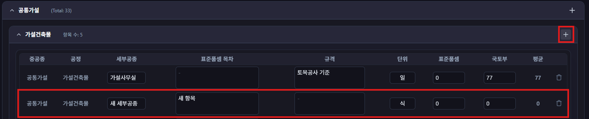
5. 불필요한 항목은 행 삭제 버튼으로 삭제합니다.
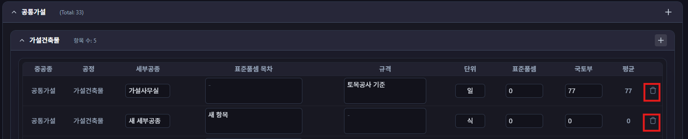
6. `저장` 버튼 또는 `Ctrl+s` 으로 최종 저장합니다.


#### 자주 막히는 점

- 이름을 바꾼 뒤 반영이 헷갈리면 검색창에 새 이름을 넣어 실제 반영 여부를 확인하세요.
- 입력 후 자동 저장 표시가 떠도, 작업 마감 전에는 `저장` 버튼으로 한 번 더 확정하는 것을 권장합니다.

---

#### 공통

세 화면 모두 같은 구조로 사용합니다.

- `작업 결과표`: 실제 입력값과 결과 확인
- `기준표`: 속도/시간 기준값 관리
- `생산성 산출 내역`: 계산에 쓰이는 상세 항목 관리

상단 `저장` 버튼으로 전체 저장할 수 있고, 대부분의 셀은 입력 후 포커스를 옮기면 개별 저장됩니다.

### 5.2) CIP 생산성 관리

#### 따라하기

```demo
cip_basis
```

1. 직경, 지층별 깊이, 비트 타입을 입력합니다.
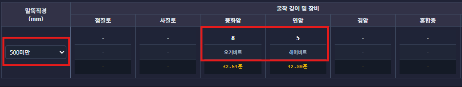
2. 작업시간과 일일 생산성이 자동으로 계산되는지 확인한 뒤 저장합니다.


### 5.3) 기성말뚝 생산성 관리

#### 따라하기

```demo
pile_basis
```

1. 직경, 지층별 깊이, 말뚝 타입을 입력합니다.
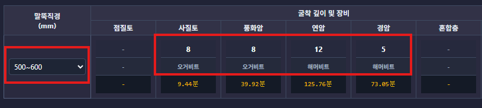
2. 용접 관련 시간을 포함한 계산 결과를 확인한 뒤 저장합니다.


### 5.4) 현장타설말뚝 생산성 관리

#### 따라하기

```demo
bored_pile_basis
```

1. 공법, 직경, 지층별 깊이를 입력합니다.
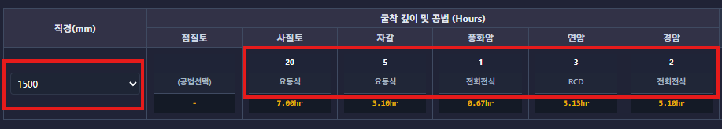
2. 공법별 기준값 기반 계산 결과를 확인한 뒤 저장합니다.
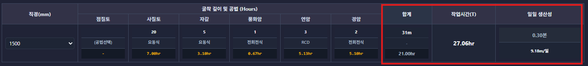
#### 자주 막히는 점

- 값이 비정상적으로 보이면 먼저 직경/공법/지층 입력 누락이 없는지 확인하세요.
- 기준표를 바꾼 경우 결과표와 산출내역을 다시 확인하세요.

---

## 6) 공기산정

### 6.1) 공기산정기준 - 테이블 화면

#### 이 화면에서 하는 일

- 전체 공정 항목 작성 및 기간 계산
- 대공종/공정 구조 관리
- 표준품셈/근거데이터 연동

#### 상단 기능

- `테이블 뷰`, `간트차트` 전환
- 실행취소, 다시실행
- `스냅샷/히스토리`
- `시작일` 변경
- `목표 공기` 입력 후 `기간 조정` 버튼 클릭
- `취소/되돌리기` 또는 Ctrl + z
- `엑셀 내보내기`
- `저장` 또는 Ctrl + s

#### 공정표 작성 흐름

```demo
schedule
```

1. `대공종 추가`로 대공종을 만듭니다.

2. 각 대공종에서 항목을 추가합니다.

3. 중공종, 공정, 세부공종, 내역수량, 단위 작업량, 투입조를 입력합니다.
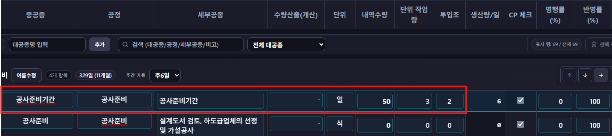
4. 계산된 `생산량/일`, `작업기간`, `Cal Day`를 확인합니다.

5. 저장버튼 클릭 또는 Ctrl+s로 저장합니다.

#### 대공종 운영 기능

- `이름수정`
- 위/아래 이동

- 주간 가동(주 5일/6일/7일)

- 더보기 메뉴
  - `표준품셈 선택`
  - `근거 데이터 반영`
  - `층별 공정 생성`(대공종이 골조공사일 시 활성화)
  - `대공종 삭제`

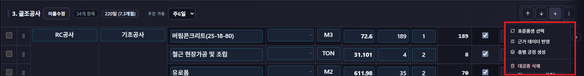

#### 표 작업 기능

- 검색 및 대공종 필터


- 행 체크박스 선택 (shift + 드래그로 일괄 선택 가능)
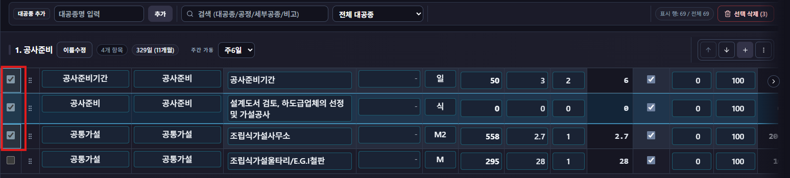

- 선택 삭제
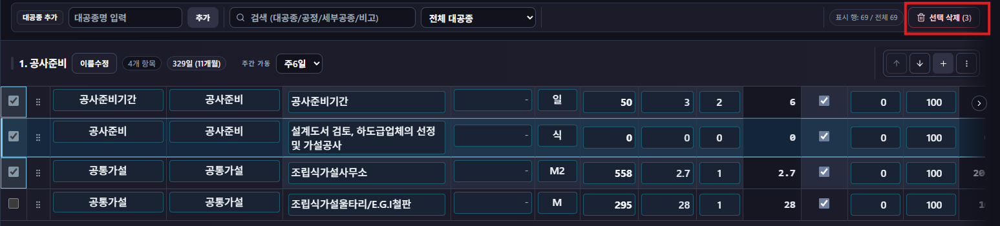

- 드래그 정렬(같은 대공종 안에서 이동)
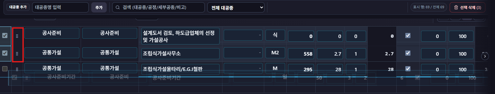

- 비고 입력

#### 자주 막히는 점

- 기간이 0으로 보이면 수량, 단위 작업량, 투입조 중 빈값이 없는지 확인하세요.
- 다른 대공종으로 드래그가 안 되는 것은 정상 동작입니다.

---

### 6.2) 공기산정기준 - 간트 화면 (데모기능) 

#### 이 화면에서 하는 일

- 일정 시각화
- 선후행 관계 설정
- 부세부공종 관리
- 겹침 조정

#### 주요 기능

- 보기 기준 변경: `중공종별`, `공정별`, `세부공종별`


- 시간축 변경: `일별`, `5일 단위`, `10일 단위`, `월별`


- `링크 편집` 모드로 선후행 연결 생성


- 링크 상세 편집
  - 유형 선택
  - 간격(지연일) 입력
  - 링크 삭제
  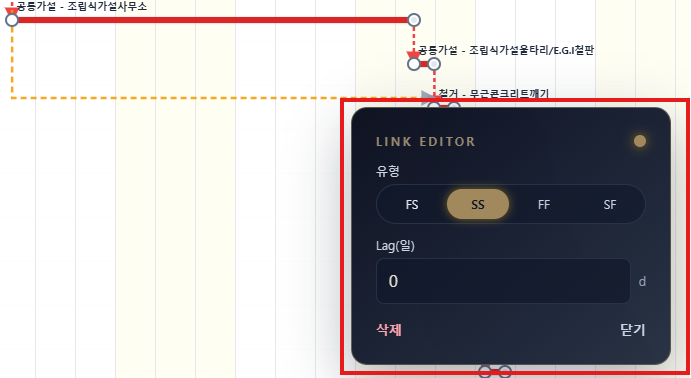

- `부세부공종 추가` 모드에서 드래그로 추가
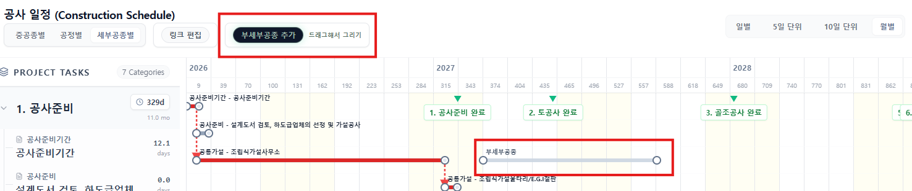

- 드래그로 부세부공종 이동, 길이 조정, 삭제. 더블클릭으로 이름 변경

- CP(빨간색) 막대 이동 중 겹침 발생 시 우선 경로 선택 팝업


#### 자주 막히는 점

- 링크가 안 걸리면 먼저 `링크 편집` 모드가 켜져 있는지 확인하세요.
- 부세부공종이 생성되지 않으면 겹침 제한 구간인지 확인하세요.

---

### 6.3) 목표 공기 맞추기 (AI 조정)

#### 이 화면에서 하는 일

- 목표 공기를 입력해 자동 조정안 확인
- 적용 전후 비교

#### 따라하기

```demo
ai_adjust
```

1. 공기산정기준 상단에 목표 공기(일)를 입력합니다.


2. `기간 조정`을 실행합니다.

3. 오른쪽 로그에서 변경 이력을 확인합니다.

4. `Compare`로 변경 전후를 확인합니다.
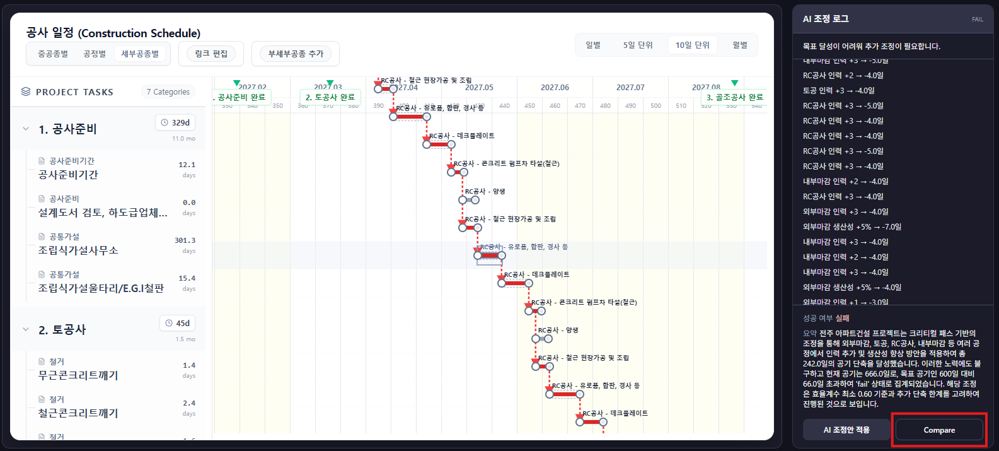

5. 괜찮으면 `AI 조정안 적용`을 누릅니다.
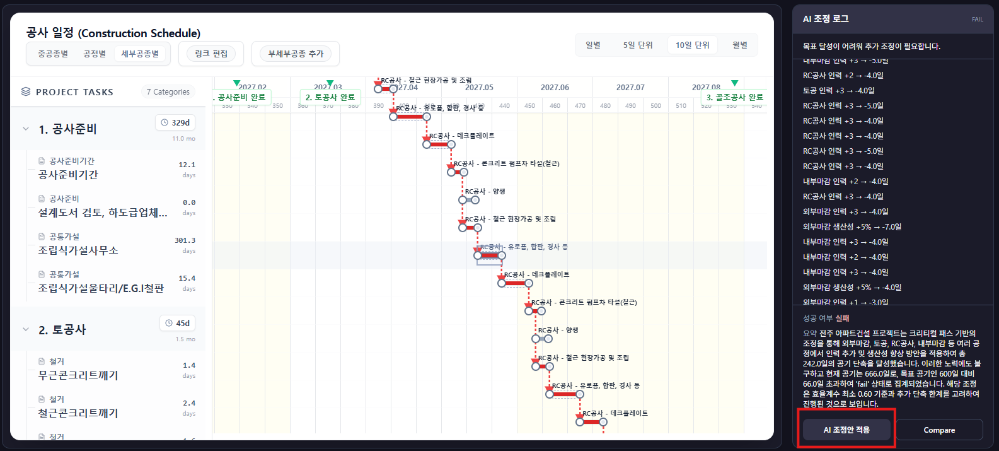

6. 필요하면 `취소/되돌리기`로 원복합니다.


7. 최종 저장합니다.

#### 자주 막히는 점

- AI 결과만 보고 화면을 벗어나면 반영이 유실될 수 있으니 적용 후 저장까지 완료하세요.

---

### 6.4) 스냅샷/히스토리

#### 이 화면에서 하는 일

- 작업 버전 저장
- 저장한 버전 복구
- 불필요 버전 삭제

#### 따라하기

1. 상단 `스냅샷/히스토리`를 엽니다.

2. 버전 이름을 입력하고 저장합니다.
3. 필요 시 원하는 버전을 복구합니다.
4. 오래된 버전은 삭제합니다.

#### 자주 막히는 점

- 복구하면 현재 작업 내용이 대체되므로 복구 전에 현재 상태를 새 스냅샷으로 남겨두는 것을 권장합니다.

---

### 6.5) 요약장표 (데모기능)

#### 이 화면에서 하는 일

- 프로젝트 개요 확인
- 대공종/중공종 기간 집계 확인
- 대공종별 소계와 비중 확인

#### 따라하기

1. `요약장표`로 이동합니다.
2. 상단 요약 정보(공종 수, 총 공기)를 확인합니다.
3. 표에서 대공종별 소계와 비중을 검토합니다.
4. 최종 보고 전 마지막 점검 화면으로 사용합니다.

#### 자주 막히는 점

- 수치가 비어 있으면 공기산정기준 화면에서 저장이 완료됐는지 확인하세요.

---

### 6.6) 내보내기

#### 이 화면에서 하는 일

- 외부 공유용 파일 생성

#### 따라하기

1. 공기산정기준에서 `엑셀 내보내기`를 실행합니다.
2. 상단 헤더에서 `보고서 내보내기`를 실행합니다.
3. 보고서 목차 번호가 바로 맞지 않으면 문서를 연 뒤 전체 선택 후 목차 업데이트를 실행합니다.

#### 자주 막히는 점

- 다운로드가 안 되면 브라우저의 다운로드 차단, 팝업 차단 설정을 확인하세요.

---

## 7) 단축키 모음

- 저장: `Ctrl + S` 또는 `Cmd + S`
- 실행 취소: `Ctrl + Z` 또는 `Cmd + Z`
- 다시 실행: `Ctrl + Shift + Z` 또는 `Cmd + Shift + Z`
- 공정표 전체 선택: `Ctrl + A` 또는 `Cmd + A`
- 선택 항목 삭제: `Delete` 또는 `Backspace`
- 편집 중 취소: `Esc`
- 간트 부세부공종 복사/붙여넣기: `Ctrl/Cmd + C`, `Ctrl/Cmd + V`

---

## 8) 운영 팁

- 공정표 작업 전 `가동률`을 먼저 맞추면 재작업이 줄어듭니다.
- 대량 수정 전에는 스냅샷을 먼저 남겨두세요.
- AI 조정은 반드시 적용 여부를 확인하고 최종 저장까지 완료하세요.
- 보고서 내보내기 전에는 요약장표에서 총 공기와 비중을 마지막으로 점검하세요.
